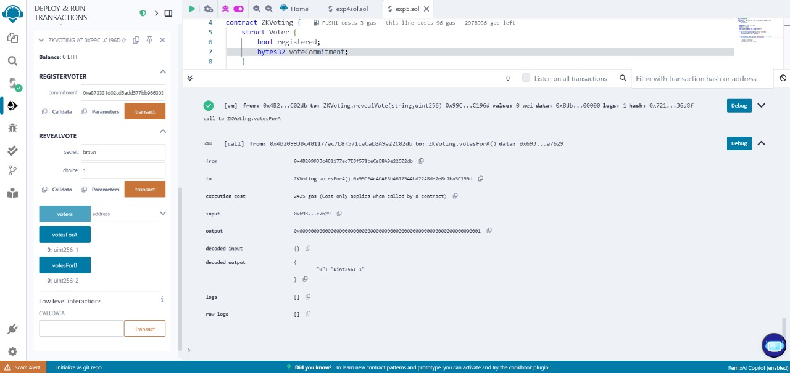
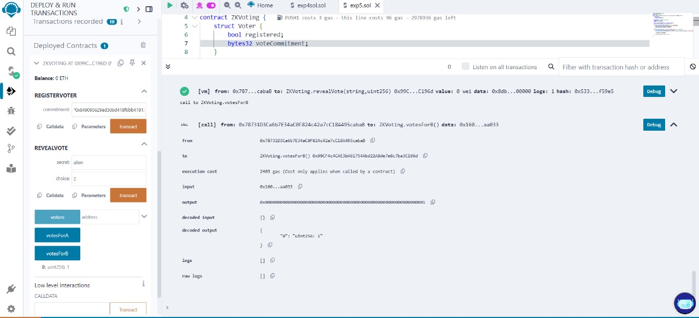
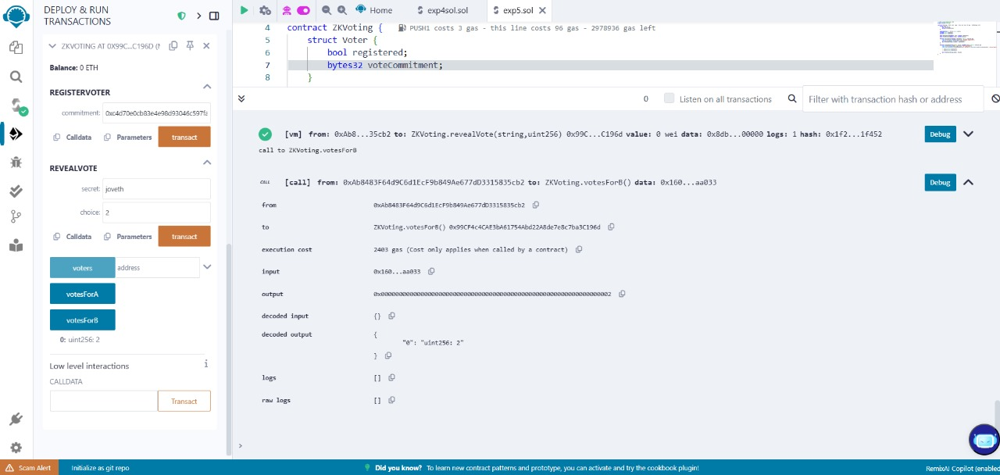
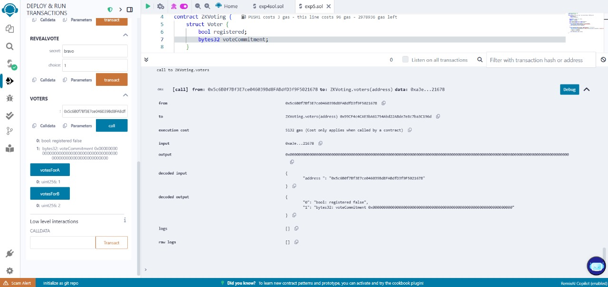
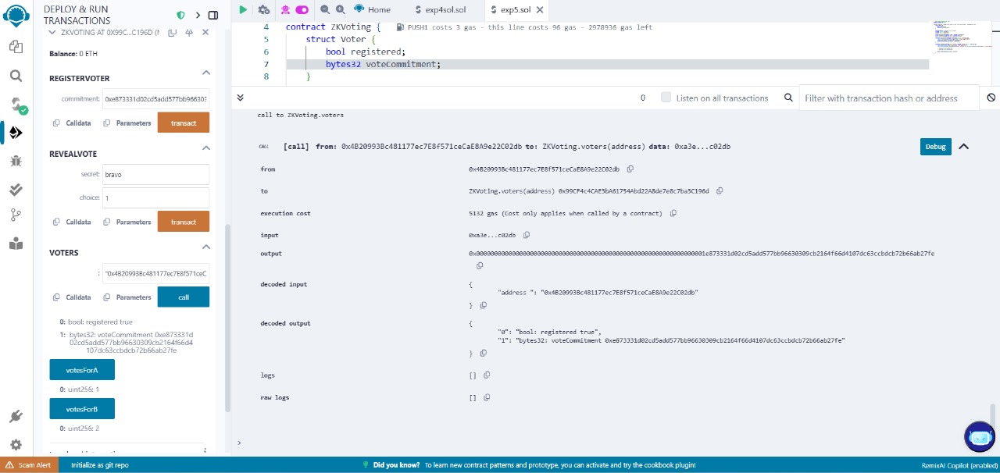

# Experiment 5: Zero-Knowledge Proof (ZK) Private Voting System
# Aim:
To implement a fully private and transparent voting system using Zero-Knowledge Proofs (ZKPs). This ensures that votes are counted fairly without revealing who voted for whom.

# Algorithm:
Step 1: Voter Registration
Each voter generates a secret vote key and submits a commitment (hashed vote) to the contract.


Step 2: Voting Process
Voters submit their votes privately using a hash, without revealing their choice.


Step 3: ZK Verification
The contract verifies if a vote belongs to a registered voter but does not reveal the actual vote.


Step 4: Vote Counting
Once voting ends, the contract reveals the final tally without linking votes to individuals.


# Program:
```
// SPDX-License-Identifier: MIT
pragma solidity ^0.8.20;

contract ZKVoting {
    struct Voter {
        bool registered;
        bytes32 voteCommitment;
    }

    mapping(address => Voter) public voters;
    uint256 public votesForA;
    uint256 public votesForB;

    event VoteCommitted(address voter, bytes32 commitment);
    event VoteRevealed(address voter, uint256 choice);

    function registerVoter(bytes32 commitment) public {
        require(!voters[msg.sender].registered, "Already registered");
        voters[msg.sender] = Voter(true, commitment);
        emit VoteCommitted(msg.sender, commitment);
    }

    function revealVote(string memory secret, uint256 choice) public {
        require(voters[msg.sender].registered, "Not registered");
        require(keccak256(abi.encodePacked(secret, choice)) == voters[msg.sender].voteCommitment, "Invalid proof");

        if (choice == 1) votesForA++;
        if (choice == 2) votesForB++;

        emit VoteRevealed(msg.sender, choice);
    }
}

```
# Expected Output:







# High-Level Overview:
Uses ZKPs to ensure anonymous and fair elections.


Prevents vote tampering while maintaining voter privacy.


Mimics real-world ZK voting applications in governance and DAOs.

# RESULT: 
